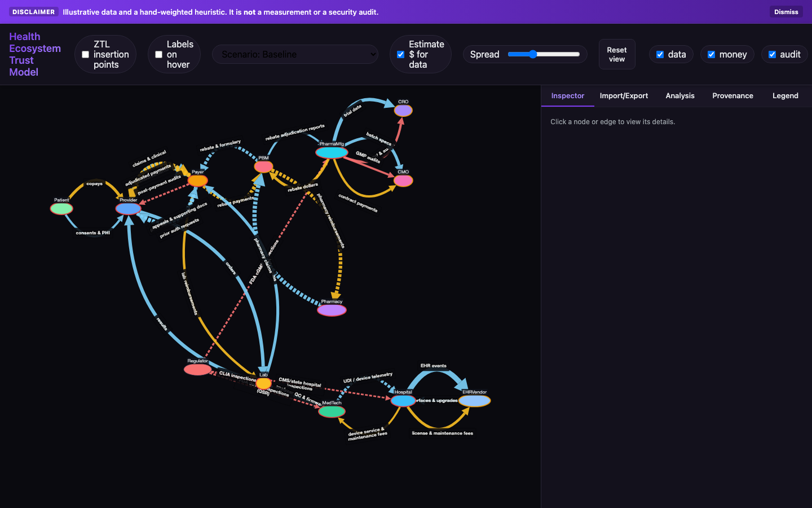

# Health Ecosystem Trust Model

A web app that maps US healthcare roles and the data, money and audit flows between them. Each flow carries scores for sensitivity, friction and trust gap, and a heuristic turns those into a ranked list of where cryptographic proof might be worth adding. The numbers are illustrative; this is a modeling tool, not a measurement.

**Status: prototype.** 13 unit tests pass and `npm run build` passes with one bundle-size warning (October 2, 2026; Node 22.19.0, Apple Silicon Mac). The dev server and the production preview both serve the page.

[](https://github.com/cyber-physical-engineering/health_ecosystem_trust_model/actions/workflows/pages.yml)

James Thornton set the architecture and requirements. The code was written with AI-assisted development in late 2025. The tests and checks were re-run in October 2026.



Live demo: https://cyber-physical-engineering.github.io/health_ecosystem_trust_model/ (the model lives in your browser; nothing is sent anywhere)

## What it does

- Draws 13 actor roles (provider, payer, drug maker, PBM, regulator and others) and 34 flows (17 data, 10 money, 7 audit) with Cytoscape.js and the dagre layout. The roles are generic, not organizations.
- Every seed flow carries 0 to 100 scores for sensitivity, friction and trust gap. The values were typed in by hand as illustrative estimates. They are not measured, sourced or audited.
- Edge color shows the flow type, edge width grows with volume, and a flow with a trust gap of 60 or more is dashed.
- Hovering a node shows its incentives, liabilities, data assets, and trust and conflict scores.
- A header toggle, "ZTL insertion points", highlights every flow whose trust gap and sensitivity are both 60 or more (11 of the 34 seed flows). ZTL is the ZeroTrust Ledger, a tamper-evident record prototype; its cryptographic engine is public at https://github.com/cyber-physical-engineering/secure_crate.
- A scenario control cuts the trust gap of the highlighted flows by 15% or 40%, to show the effect of adding proof.
- Each flow gets one dollar amount: an explicit economic value, else a money flow's dollar value, else unit count times unit value, marked "(est.)". 15 seed flows carry a dollar amount; 19 carry none.
- A heuristic score multiplies a flow's dollars by its friction and trust-gap percentages. It adds a legal-dispute cost for money flows and a capped audit cost for audit flows, then applies an interface multiplier (EDI and FHIR 1.25, HL7v2 1.15). The weights are set by hand.
- The Analysis tab ranks flows by that score divided by the square root of the flow's dollar amount. Flows without a dollar amount are not scaled down, so audit flows lead the seed ranking.
- A pink dashed edge marks a BAA gap: a sensitive data flow from a provider, hospital or payer to a PBM, EHR vendor, CRO or CMO. The flag applies only when no business associate agreement is recorded and the data is not de-identified. The shipped seed has no such flow.
- The model saves to browser localStorage, imports and exports JSON (checked with Zod, which lists field errors), and exports the graph as PNG or SVG.

## Quick start

```bash
npm i
npm run dev
```

Open http://localhost:3002.

```bash
npm test          # 13 unit tests
npm run build     # production build (one chunk-size warning)
npm run preview   # serves the build on http://localhost:4173
```

## Editing the model

Import a JSON file to replace the whole model. A few flow fields can be edited in the side panel: the three strategic-fit sliders, the narrative tag, and the provenance source and confidence. Audit flows also expose their site count and violation rate. The actor panel is read-only.

To add an actor type or flow type, change these places:

1. The enums in `src/domain/schema.ts`.
2. The colors in `src/components/GraphCanvas.tsx`.
3. The list in `src/components/Legend.tsx`.
4. For a flow type, the chip list in `src/App.tsx` and the visibility defaults in `src/state/store.ts`.
5. Optionally, the seed in `src/domain/seed.ts`, so it appears on first load.

## Tests

The 13 tests cover the domain helpers: the ROI arithmetic (`src/domain/math.test.ts`), the CRO-to-pharma calibration (`src/domain/calibrate.test.ts`) and the BAA-gap rule (`src/domain/compliance.test.ts`). The UI panels have no tests.

## Limits

- The data is illustrative. No seed value cites a source; the "source" tags such as `finance:FY24` are labels.
- The score is a hand-weighted heuristic. It computes no payback time and no measured return. "ROI" in the Analysis tab means that heuristic.
- There are no add or delete controls for actors or flows, no layout toggle (dagre only) and no Delete key; edit the model through JSON import.
- "(est.)" labels appear in the Inspector and the dollar lists, not in every table.
- The Inspector's control prompts are generic reminders with the HIPAA paragraphs they relate to. They are a starting point for a reviewer, not advice and not a compliance finding.
- Import does not check that a flow's endpoints exist. A flow that points at a missing actor is dropped silently when the graph draws.
- The production bundle is one chunk of about 875 kB (274 kB gzipped).

## License

MIT. See [LICENSE](LICENSE).
